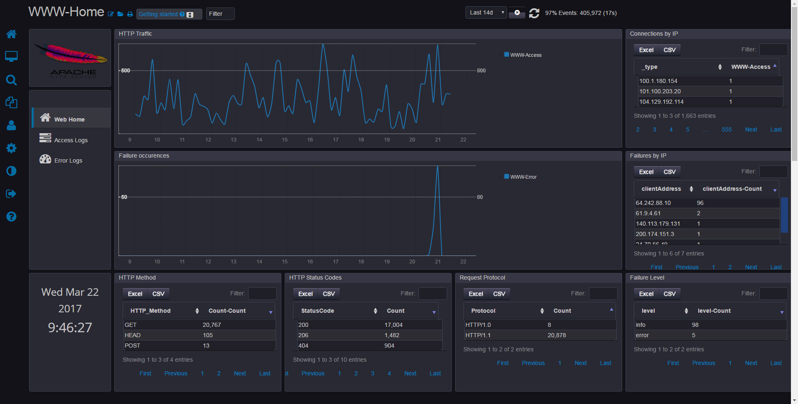

# Apache And NGINX app.
This app monitors web-log traffic for Apache and NGINX applications. 
NGINX log formats will match out of the box, whereas Apache installations will need to be configured to using the `combined` logging format.

# Downloads

Read [How to deploy](http://logscape.github.io/deploy.html) for basic App installation instructions  
Read [How to import data](http://logscape.github.io/ds-add.html) to learn about data sources

Download [the App](https://github.com/logscape/apacheNginx/raw/master/dist/WebLogsApp-1.0.zip).

# Access Log Format
The expected log format is as follows
`"%h %l %u %t \"%r\" %>s %b \"%{Referer}i\" \"%{User-agent}i\"" `
%h - ip
%l - RFC 1413 ID
%u - HTTP Authed user
%t - timestamp
%r - request
%s - HTTP Status
%b - Request size
%referer - Referer
%user-agent - user agent

# NGINX
Default NGINX configuration is supported as standard.

# Apache
Apache installations will need to be configured to use the `combined` log format, you can find information on that [here](https://httpd.apache.org/docs/2.4/logs.html#accesslog).

